# Catering Sipariş ve Dağıtım Takip Sistemi

## Öğrenci Bilgileri
Ad Soyad: Azra Delen  
Öğrenci No: 243301026  
Ders: Mobil Programlama Final Projesi

## Uygulama Açıklaması
Bu proje Flutter ve Supabase kullanılarak geliştirilmiş bir catering sipariş ve dağıtım takip sistemidir. Uygulamada müşteri, admin ve kurye rolleri bulunmaktadır. Müşteri yemekleri kategorilere ayrılmış şekilde görüntüleyebilir, sepete ürün ekleyebilir ve sipariş oluşturabilir. Admin siparişleri yönetebilir, kurye atayabilir ve menü yönetimi yapabilir. Kurye ise kendisine atanan teslimatları görüntüleyip teslim edildi olarak işaretleyebilir.

## Kullanılan Teknolojiler ve Paketler
- Flutter
- Dart
- Supabase
- supabase_flutter
- shared_preferences

## Roller ve Test Hesapları

### Müşteri
E-posta: delenazra092@gmail.com  
Şifre: azratest  
Rol: customer

### Admin
E-posta: elif33r@gmail.com  
Şifre: elif33 
Rol: admin

### Kurye
E-posta: denizata@gmail.com  
Şifre: denizata 
Rol: courier

## Uygulama Özellikleri
- Kullanıcı kayıt, giriş ve çıkış işlemleri
- Oturum bilgisinin uygulama kapatılıp açıldığında korunması
- Rol bazlı ekran yönlendirme
- Kategori bazlı yemek listeleme
- Yemek detay ekranı
- Sepet sistemi
- Sipariş oluşturma
- Sipariş takibi
- Admin sipariş yönetimi
- Admin menü yönetimi
- Kurye takip ekranı
- Kurye teslim edildi işlemi
- Log kayıtlarının görüntülenmesi

## Veritabanı
Supabase üzerinde aşağıdaki tablolar kullanılmıştır:
- users
- menu_items
- orders
- order_details
- deliveries
- logs

## Ekran Görüntüleri
Aşağıya uygulamaya ait ekran görüntüleri eklenmiştir.

### Login Ekranı
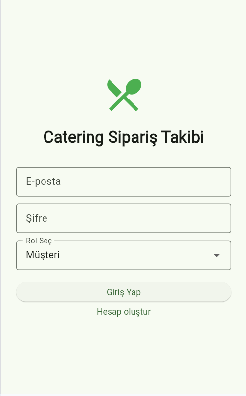

### Kategoriler Ekranı
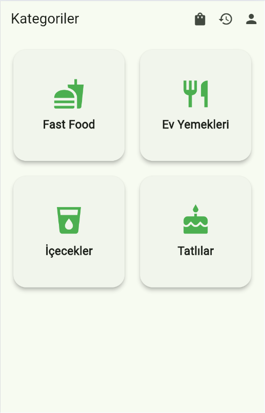

### Sipariş Takip Ekranı
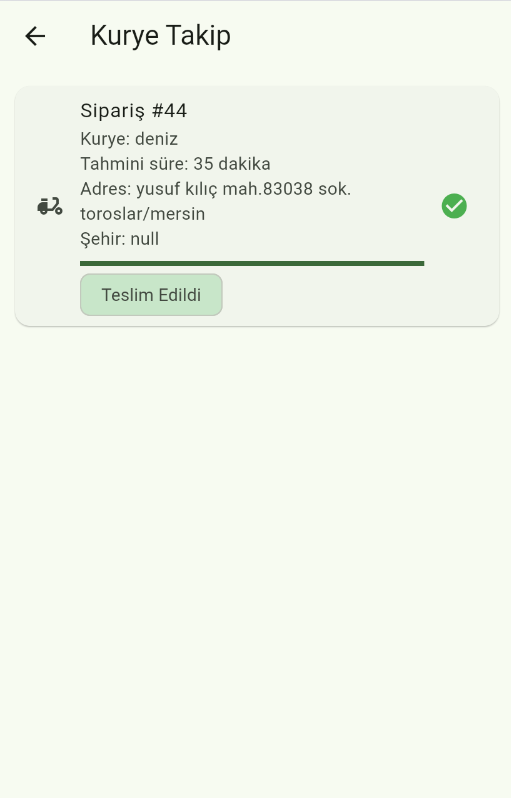

### Yemek Detay Ekranı
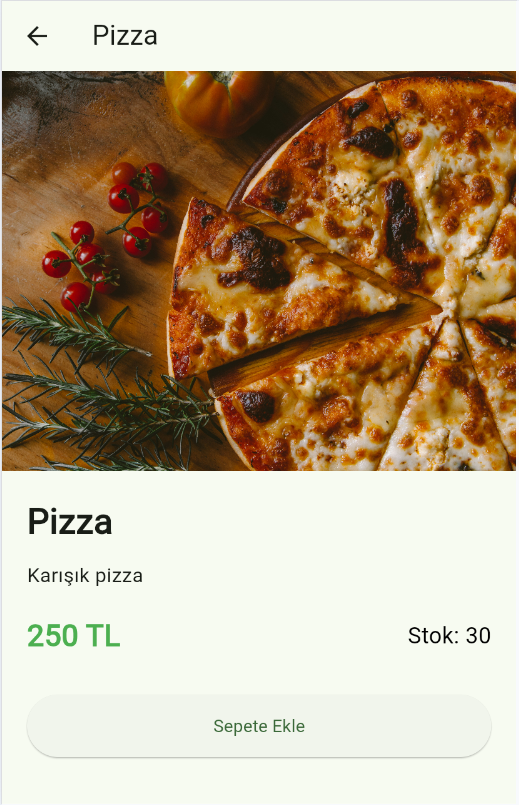

### Sepet Ekranı
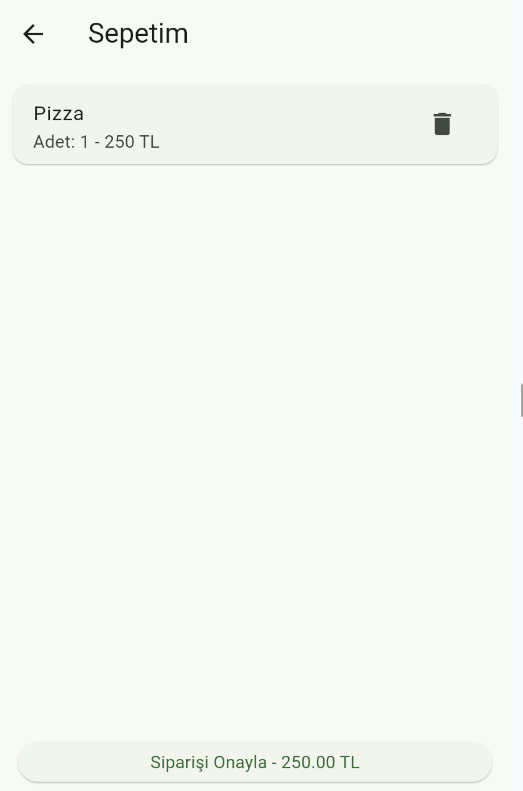

### Siparişlerim Ekranı
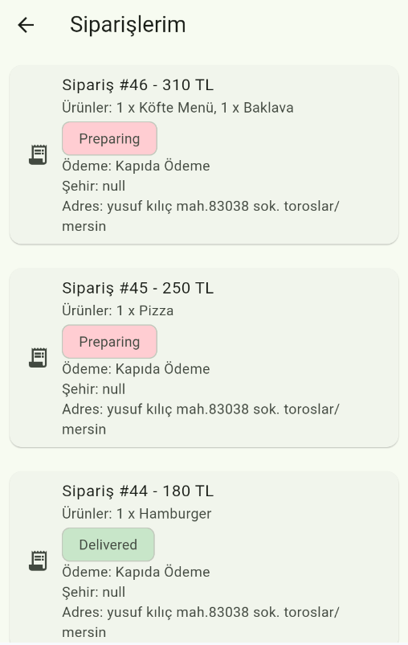

### Admin Paneli
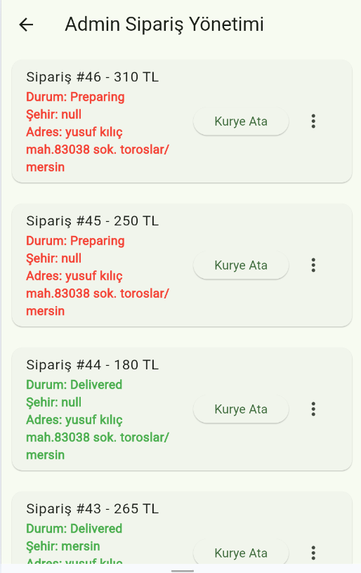

### Kurye Takip Ekranı

### Menü Yönetimi
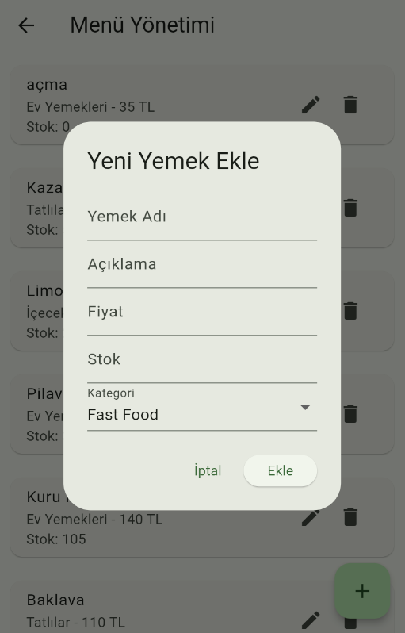

### Profil Ekranı
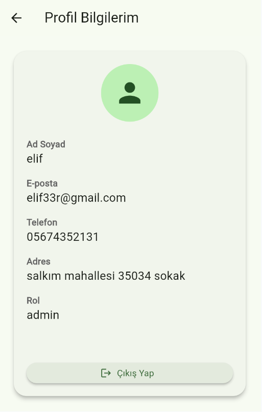

### Register Ekranı
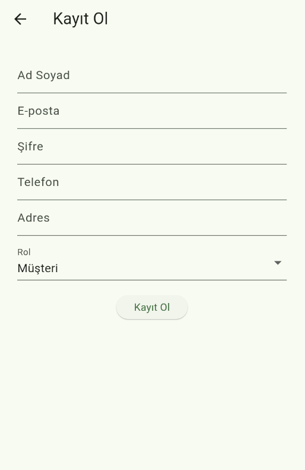

### Sistem Logları
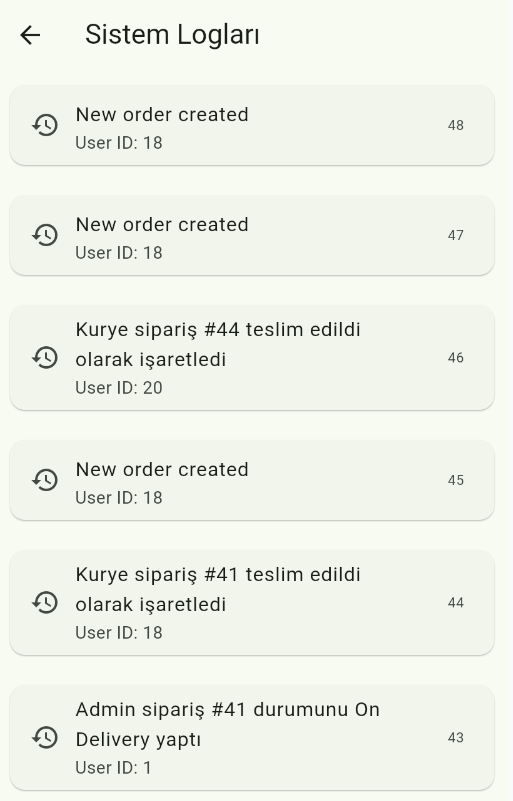